# AI-DLC Adaptive Workflow Overview

**Purpose**: Technical reference for AI model and developers to understand complete workflow structure.

**Note**: Similar content exists in welcome-message.md (user welcome message) and README.md (documentation). This duplication is INTENTIONAL - each file serves a different purpose:
- **This file**: Detailed technical reference with Mermaid diagram for AI model context loading
- **welcome-message.md**: User-facing welcome message with ASCII diagram
- **README.md**: Human-readable documentation for repository

## The Four-Phase Lifecycle:
• **INCEPTION PHASE**: Planning and architecture (Workspace Detection + conditional phases + Workflow Planning)
• **CONSTRUCTION PHASE**: Design, implementation, build and test (per-unit design + Code Generation + Build & Test)
• **VERIFICATION PHASE**: Test strategy, environment, implementation, E2E validation, CI pipeline, production readiness gate
• **DEPLOYMENT PHASE**: Establish production deployment capability (strategy, CD pipeline, first deploy, rollback validated) — 7 stages

## The Adaptive Workflow:
• **Workspace Detection** (always) → **Reverse Engineering** (brownfield only) → **Requirements Analysis** (always, adaptive depth) → **Conditional Phases** (as needed) → **Workflow Planning** (always) → **Code Generation** (always, per-unit) → **Build and Test** (always) → **VERIFICATION** (always, 8 stages) → **DEPLOYMENT** (always, 7 stages)

## How It Works:
• **AI analyzes** your request, workspace, and complexity to determine which stages are needed
• **These stages always execute**: Workspace Detection, Requirements Analysis (adaptive depth), Workflow Planning, Code Generation (per-unit), Build and Test
• **All other stages are conditional**: Reverse Engineering, User Stories, Application Design, Units Generation, per-unit design stages (Functional Design, NFR Requirements, NFR Design, Infrastructure Design)
• **No fixed sequences**: Stages execute in the order that makes sense for your specific task

## Your Team's Role:
• **Answer questions** in dedicated question files using [Answer]: tags with letter choices (A, B, C, D, E)
• **Option E available**: Choose "Other" and describe your custom response if provided options don't match
• **Work as a team** to review and approve each phase before proceeding
• **Collectively decide** on architectural approach when needed
• **Important**: This is a team effort - involve relevant stakeholders for each phase

## AI-DLC Four-Phase Workflow:

```mermaid
flowchart TD
    Start(["User Request"])
    
    subgraph INCEPTION["🔵 INCEPTION PHASE"]
        WD["Workspace Detection<br/><b>ALWAYS</b>"]
        RE["Reverse Engineering<br/><b>CONDITIONAL</b>"]
        RA["Requirements Analysis<br/><b>ALWAYS</b>"]
        Stories["User Stories<br/><b>CONDITIONAL</b>"]
        WP["Workflow Planning<br/><b>ALWAYS</b>"]
        AppDesign["Application Design<br/><b>CONDITIONAL</b>"]
        UnitsG["Units Generation<br/><b>CONDITIONAL</b>"]
    end
    
    subgraph CONSTRUCTION["🟢 CONSTRUCTION PHASE"]
        FD["Functional Design<br/><b>CONDITIONAL</b>"]
        NFRA["NFR Requirements<br/><b>CONDITIONAL</b>"]
        NFRD["NFR Design<br/><b>CONDITIONAL</b>"]
        ID["Infrastructure Design<br/><b>CONDITIONAL</b>"]
        CG["Code Generation<br/><b>ALWAYS</b>"]
        BT["Build and Test<br/><b>ALWAYS</b>"]
    end
    
    subgraph VERIFICATION["🔬 VERIFICATION PHASE"]
        TSD["Test Strategy Design<br/><b>ALWAYS</b>"]
        TED["Test Environment Design<br/><b>ALWAYS</b>"]
        TES["Test Environment Setup<br/><b>ALWAYS</b>"]
        TDG["Test Diagnosis<br/><b>ALWAYS</b>"]
        TI["Test Implementation<br/><b>CONDITIONAL</b>"]
        E2E["E2E Validation<br/><b>ALWAYS</b>"]
        CIP["CI Pipeline Implementation<br/><b>ALWAYS</b>"]
        PRG["Production Readiness Gate<br/><b>ALWAYS</b>"]
    end
    
    subgraph DEPLOYMENT["🟡 DEPLOYMENT PHASE"]
        DSD["Strategy Design<br/><b>ALWAYS</b>"]
        CDPD["Pipeline Diagnosis<br/><b>CONDITIONAL</b>"]
        CDD["Pipeline Design<br/><b>ALWAYS</b>"]
        CDI["Pipeline Implementation<br/><b>ALWAYS</b>"]
        DE["Deployment Execution<br/><b>ALWAYS</b>"]
        PDV["Post-Deploy Validation<br/><b>ALWAYS</b>"]
        RVS["Rollback + Sign-off<br/><b>ALWAYS</b>"]

        DSD --> CDPD
        CDPD --> CDD
        DSD --> CDD
        CDD --> CDI --> DE --> PDV --> RVS
    end
    
    Start --> WD
    WD -.-> RE
    WD --> RA
    RE --> RA
    
    RA -.-> Stories
    RA --> WP
    Stories --> WP
    
    WP -.-> AppDesign
    WP -.-> UnitsG
    AppDesign -.-> UnitsG
    UnitsG --> FD
    FD -.-> NFRA
    NFRA -.-> NFRD
    NFRD -.-> ID
    
    WP --> CG
    FD --> CG
    NFRA --> CG
    NFRD --> CG
    ID --> CG
    CG -.->|Next Unit| FD
    CG --> BT
    
    BT --> TSD
    TSD --> TED
    TED --> TES
    TES --> TDG
    TDG -.-> TI
    TDG --> E2E
    TI --> E2E
    E2E --> CIP
    CIP --> PRG
    
    PRG --> DSD
    RVS --> End(["Complete"])
    
    style WD fill:#4CAF50,stroke:#1B5E20,stroke-width:3px,color:#fff
    style RA fill:#4CAF50,stroke:#1B5E20,stroke-width:3px,color:#fff
    style WP fill:#4CAF50,stroke:#1B5E20,stroke-width:3px,color:#fff
    style CG fill:#4CAF50,stroke:#1B5E20,stroke-width:3px,color:#fff
    style BT fill:#4CAF50,stroke:#1B5E20,stroke-width:3px,color:#fff
    
    style TSD fill:#4CAF50,stroke:#1B5E20,stroke-width:3px,color:#fff
    style TED fill:#4CAF50,stroke:#1B5E20,stroke-width:3px,color:#fff
    style TES fill:#4CAF50,stroke:#1B5E20,stroke-width:3px,color:#fff
    style TDG fill:#4CAF50,stroke:#1B5E20,stroke-width:3px,color:#fff
    style E2E fill:#4CAF50,stroke:#1B5E20,stroke-width:3px,color:#fff
    style CIP fill:#4CAF50,stroke:#1B5E20,stroke-width:3px,color:#fff
    style PRG fill:#4CAF50,stroke:#1B5E20,stroke-width:3px,color:#fff
    
    style TI fill:#FFA726,stroke:#E65100,stroke-width:3px,stroke-dasharray: 5 5,color:#000
    style RE fill:#FFA726,stroke:#E65100,stroke-width:3px,stroke-dasharray: 5 5,color:#000
    style CDPD fill:#FFA726,stroke:#E65100,stroke-width:3px,stroke-dasharray: 5 5,color:#000
    style DSD fill:#4CAF50,stroke:#1B5E20,stroke-width:3px,color:#fff
    style CDD fill:#4CAF50,stroke:#1B5E20,stroke-width:3px,color:#fff
    style CDI fill:#4CAF50,stroke:#1B5E20,stroke-width:3px,color:#fff
    style DE fill:#4CAF50,stroke:#1B5E20,stroke-width:3px,color:#fff
    style PDV fill:#4CAF50,stroke:#1B5E20,stroke-width:3px,color:#fff
    style RVS fill:#4CAF50,stroke:#1B5E20,stroke-width:3px,color:#fff
    style Stories fill:#FFA726,stroke:#E65100,stroke-width:3px,stroke-dasharray: 5 5,color:#000
    style AppDesign fill:#FFA726,stroke:#E65100,stroke-width:3px,stroke-dasharray: 5 5,color:#000
    style UnitsG fill:#FFA726,stroke:#E65100,stroke-width:3px,stroke-dasharray: 5 5,color:#000
    style FD fill:#FFA726,stroke:#E65100,stroke-width:3px,stroke-dasharray: 5 5,color:#000
    style NFRA fill:#FFA726,stroke:#E65100,stroke-width:3px,stroke-dasharray: 5 5,color:#000
    style NFRD fill:#FFA726,stroke:#E65100,stroke-width:3px,stroke-dasharray: 5 5,color:#000
    style ID fill:#FFA726,stroke:#E65100,stroke-width:3px,stroke-dasharray: 5 5,color:#000
    
    style INCEPTION fill:#BBDEFB,stroke:#1565C0,stroke-width:3px,color:#000
    style CONSTRUCTION fill:#C8E6C9,stroke:#2E7D32,stroke-width:3px,color:#000
    style VERIFICATION fill:#E1BEE7,stroke:#6A1B9A,stroke-width:3px,color:#000
    style DEPLOYMENT fill:#FFF59D,stroke:#F57F17,stroke-width:3px,color:#000
    style Start fill:#CE93D8,stroke:#6A1B9A,stroke-width:3px,color:#000
    style End fill:#CE93D8,stroke:#6A1B9A,stroke-width:3px,color:#000
    
    linkStyle default stroke:#333,stroke-width:2px
```

**Stage Descriptions:**

**🔵 INCEPTION PHASE** - Planning and Architecture
- Workspace Detection: Analyze workspace state and project type (ALWAYS)
- Reverse Engineering: Analyze existing codebase (CONDITIONAL - Brownfield only)
- Requirements Analysis: Gather and validate requirements (ALWAYS - Adaptive depth)
- User Stories: Create user stories and personas (CONDITIONAL)
- Workflow Planning: Create execution plan (ALWAYS)
- Application Design: High-level component identification and service layer design (CONDITIONAL)
- Units Generation: Decompose into units of work (CONDITIONAL)

**🟢 CONSTRUCTION PHASE** - Design, Implementation, Build and Test
- Functional Design: Detailed business logic design per unit (CONDITIONAL, per-unit)
- NFR Requirements: Determine NFRs and select tech stack (CONDITIONAL, per-unit)
- NFR Design: Incorporate NFR patterns and logical components (CONDITIONAL, per-unit)
- Infrastructure Design: Map to actual infrastructure services (CONDITIONAL, per-unit)
- Code Generation: Generate code with Part 1 - Planning, Part 2 - Generation (ALWAYS, per-unit)
- Build and Test: Build all units and execute comprehensive testing (ALWAYS)

**🔬 VERIFICATION PHASE** - Test Strategy, Validation, and Production Readiness
- Test Strategy Design: Map boundaries, generate scenarios, classify test levels, prioritize (ALWAYS)
- Test Environment Design: Design test environment replicating production topology with fidelity assessment (ALWAYS)
- Test Environment Setup: Implement environment, validate health and connectivity, smoke test (ALWAYS)
- Test Diagnosis: Inventory tests, execute in real environment, honesty audit, gap report (ALWAYS)
- Test Implementation: Close test gaps level-by-level with typed agents (CONDITIONAL — if gaps found)
- E2E Validation: Validate complete system end-to-end following integration sequence (ALWAYS)
- CI Pipeline Implementation: Automate test suite in CI/CD with gates (ALWAYS)
- Production Readiness Gate: Compile evidence, evaluate criteria, emit GO/CONDITIONAL-GO/NO-GO verdict (ALWAYS)

**🟡 DEPLOYMENT PHASE** - Production Deployment Capability
- Strategy Design: Define deployment strategy, risk profile, and rollback criteria (ALWAYS)
- Pipeline Diagnosis: Audit existing CD pipeline and identify gaps (CONDITIONAL — brownfield only)
- Pipeline Design: Design CD pipeline architecture, environments, and gates (ALWAYS)
- Pipeline Implementation: Implement CD pipeline, Makefile targets, and environment config (ALWAYS)
- Deployment Execution: Execute first production deployment with full observability (ALWAYS)
- Post-Deploy Validation: Validate production health, metrics, and acceptance criteria (ALWAYS)
- Rollback + Sign-off: Validate rollback procedure and obtain stakeholder sign-off (ALWAYS)

**Key Principles:**
- Phases execute only when they add value
- Each phase independently evaluated
- INCEPTION focuses on "what" and "why"
- CONSTRUCTION focuses on "how" plus "build and test"
- VERIFICATION focuses on "does it work" and "is it ready"
- DEPLOYMENT focuses on "how to release safely" and "is rollback validated"
- Simple changes may skip conditional INCEPTION stages
- Complex changes get full INCEPTION, CONSTRUCTION, and VERIFICATION treatment