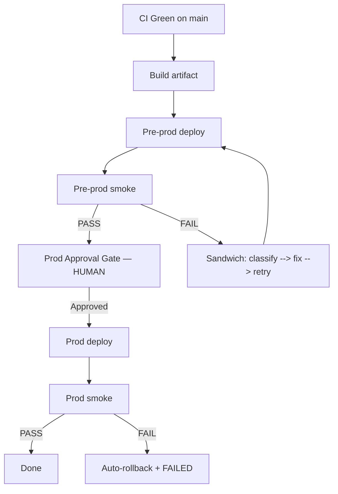

# CD Pipeline Design

**Purpose**: Design the concrete pipeline that materializes the Stage 1 strategy and pre-prod mechanism. Produces the blueprint Stage 4 will implement.

**Stage type**: DESIGN (user judgment shapes outputs — requires Question DNA and content validation for Mermaid diagrams)

## Prerequisites
- Stage 1 Deployment Strategy Design complete (blocking)
- Stage 2 CD Pipeline Diagnosis complete (blocking if brownfield)

---

## Step 1: Load Inputs

Read:
- `aidlc-docs/deployment/deployment-strategy.md`
- `aidlc-docs/deployment/cd-pipeline-diagnosis.md` (if brownfield)
- `aidlc-docs/verification/production-infrastructure-blueprint.md`
- `aidlc-docs/construction/build-and-test/build-instructions.md`

---

## Step 2: Create Plan File

Save to `aidlc-docs/deployment/plans/cd-pipeline-design-plan.md` with 11 execution step checkboxes (Steps 3–13 below).

---

## Step 3: Question DNA (7-step micro-pattern)

**MANDATORY**: Execute the 7-step Question DNA micro-pattern before proceeding.

Categories (minimum 5):
1. **Trigger** — what starts the pipeline (push to main / tag / manual dispatch / merge queue)
2. **Prod approval gate mechanism** — environment protection rules / workflow_dispatch with reviewers / tag-by-human
3. **Concurrency policy** — allow one concurrent deploy only / queue / reject
4. **Artifact registry** — where built images/binaries live
5. **Observability touchpoints** — which pipeline signals to emit (build status, deploy markers, artifact digests)

Question file: `aidlc-docs/deployment/plans/cd-pipeline-design-questions.md`. [Answer]: tags, A/B/C/D + X) Other.

Ambiguity resolution per Question DNA.

---

## Step 4: Trigger Definition

Define what starts the pipeline (from answers).

## Step 5: Promotion Flow (Mermaid diagram)

Express as Mermaid flowchart:

**MANDATORY**: Validate Mermaid syntax per `common/content-validation.md` before writing.

## Step 6: Prod Approval Gate Mechanism

Concrete mechanism that requires human action between pre-prod success and prod deploy. Document exact implementation (e.g., "GitHub environment `production` with required reviewer @team-lead").

## Step 7: Concurrency Control

Document: `concurrency: deploy-prod` in GHA / deployment lock in other platforms / queue rules for pre-prod.

## Step 8: Failure Branches

Document:
- Pre-prod fail → sandwich pattern, max 3 iterations
- Prod fail → auto-rollback + phase state FAILED + escalation

## Step 9: Environment Config

Table mapping secret names + env-specific variables (URLs, feature flags, limits) to pre-prod and prod. **Values never inline — always Parameter Store / Secrets Manager references.**

## Step 10: Artifact Versioning

Define scheme (semver, commit SHA, tag), propagation from CI, artifact registry location.

## Step 11: Rollback Mechanism

Concrete commands or workflow spec for rolling back to previous release.

## Step 12: Smoke Suite Specification

Define what the smoke test verifies at pre-prod and prod (endpoints, critical-path transactions, auth flow). Define scope + pass criteria. (Implementation happens in Stage 4.)

## Step 13: Observability Touchpoints

Pipeline-level signals only (NOT service-level SLOs).

## Step 14: Extension Compliance

Evaluate security-baseline: confirm no secrets inline, CORS/CSP reviewed where applicable.

**CRITICAL**: security-baseline is applicable at this stage. Verify Step 9 env config and Step 13 observability touchpoints do not leak secrets or PII.

## Step 15: Generate Design Artifact

**DIRECTIVE**: Generate `aidlc-docs/deployment/cd-pipeline-design.md` with all sections + validated Mermaid.

Log completion to `aidlc-docs/audit.md` with timestamp and stage context.

Update `aidlc-docs/aidlc-state.md`: mark Stage 3 in-progress.

---

## Step 16: Completion Message

3-part per Pattern 2.4. Next stage: **CD Pipeline Implementation**.

## Step 17: Approval Gate

Standard 2-option. On approval, mark Stage 3 complete in `aidlc-docs/aidlc-state.md`.

Log user approval to `audit.md`.

## Extension Compliance Hooks

security-baseline applicable: verify Step 9 env config and Step 13 observability touchpoints do not leak secrets or PII.
